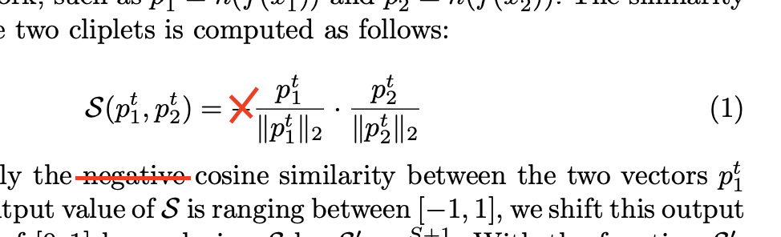

# SimSiam network for measuring the similarity between TMs using letter cliplets

This is a PyTorch implementation of the network described in the paper "Stylistic Similarities in Greek Papyri based on Letter Shapes: A Deep Learning approach"

## Paper correction
There is a small mistake in formula 1 - page 7 of the paper. The minus sign shouldn't be there!



## Compatibility
The dependencies can be installed by running the following command:
```bash
pip install -r requirements.txt
```

## Pretrained model
The pretrained model can be downloaded here: https://drive.google.com/file/d/1JMkPDpxRTvJ828Tu_EM2PmtufSvRtiGH/view?usp=sharing

## Training
Run the following command to start the training:
```bash
train.py --tm_dataset_path /path/to/BT1 --n_epochs_per_eval 5 --lr 4e-4 --cuda --batch_size 196 --arch resnet18 --image_size 64 --letters α ε μ
```